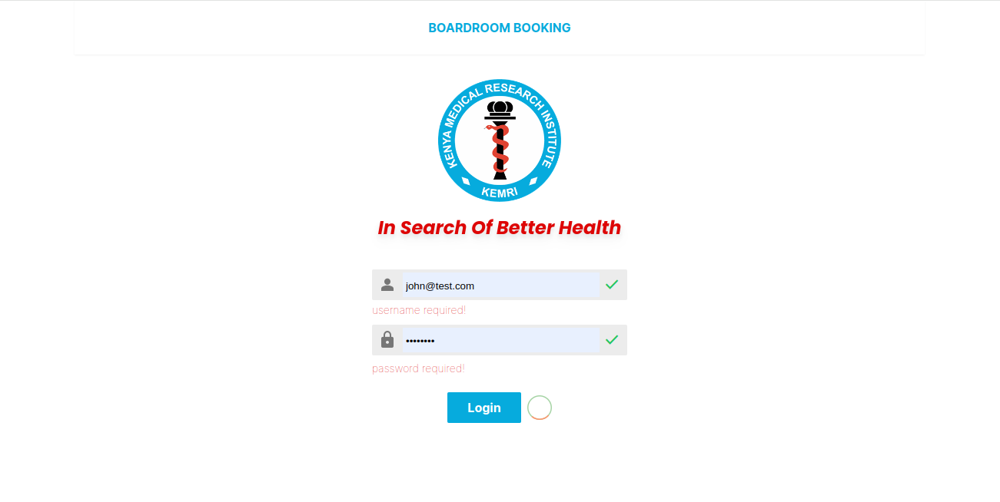
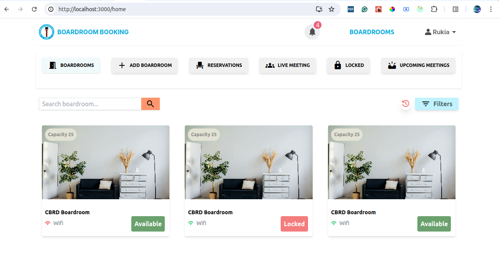
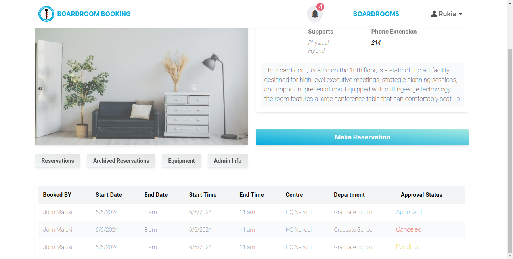
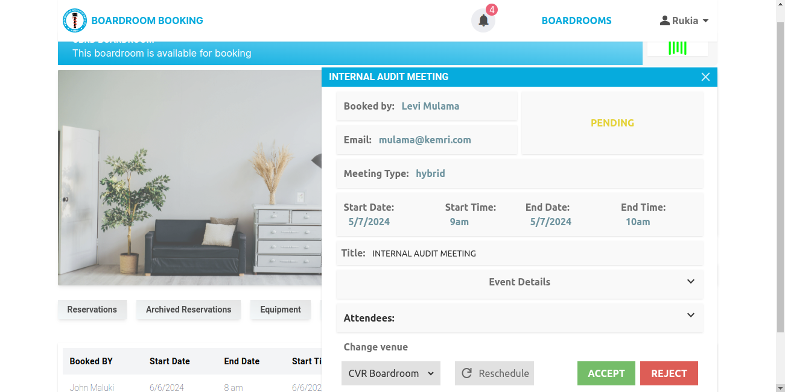

# KEMRI BOARDROOM BOOKING APP

## Overview

The app offers a streamlined solution for booking meeting rooms at [KEMRI](https://www.kemri.go.ke/) centers.

### Current Solutions and Future Developments

- The app integrates with Active Directory for user authentication.
- It offers features for reservation approval and rescheduling.
- The user interface is designed for ease of use.
- Additionally, notifications are enabled via email and within the app.
- The app tracks all equipment in each boardroom.

## Requirements
For building and running the application you need:
- [ Java 17](https://www.oracle.com/java/technologies/javase/jdk17-archive-downloads.html)
- [ Spring boot 3.3.1](https://spring.io/projects/spring-boot)

## Screenshots of the project

- Login Page
  
- Homepage
  
- Boardroom Detail Page
  
  - Details Page with Approval Popup
  

## Acknowledgements
We would like to express our gratitude to the open-source community and all the developers whose libraries and tools have made this project possible.
Thank you for using this app! We hope it helps you on your journey to a successful.

## Copyright

Released under the **Apache License 2.0** License. See the [LICENSE](https://github.com/john-maluki/boardroom-booking-backend/blob/main/LICENSE) file.